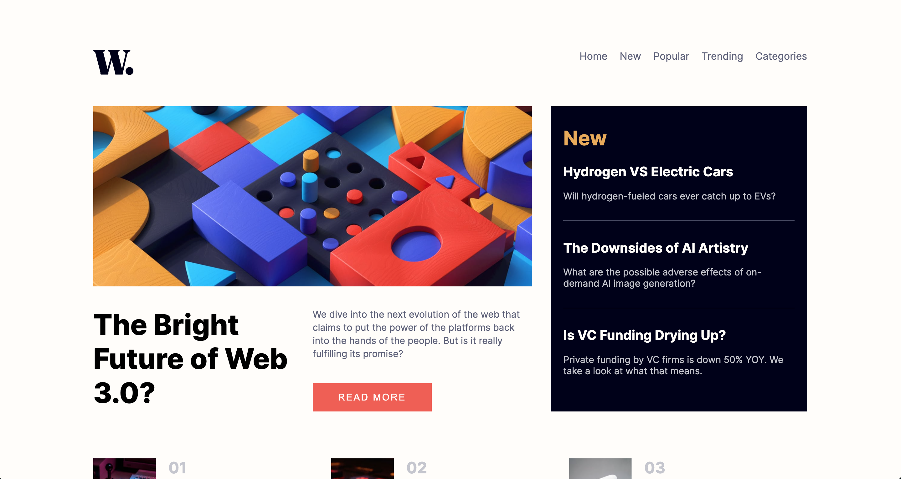

# Frontend Mentor - News homepage solution

This is a solution to the [News homepage challenge on Frontend Mentor](https://www.frontendmentor.io/challenges/news-homepage-H6SWTa1MFl). Frontend Mentor challenges help you improve your coding skills by building realistic projects. 

## Table of contents

- [Overview](#overview)
  - [The challenge](#the-challenge)
  - [Screenshot](#screenshot)
  - [Links](#links)
- [My process](#my-process)
  - [Built with](#built-with)
  - [What I learned](#what-i-learned)
  - [Continued development](#continued-development)
- [Author](#author)

## Overview

### The challenge

Users should be able to:

- View the optimal layout for the interface depending on their device's screen size
- See hover and focus states for all interactive elements on the page

### Screenshot



### Links

- Live Site URL: https://alfiemitchell123.github.io/Frontend-Mentor-News-Homepage/

## My process

### Built with

- Semantic HTML5 markup
- CSS custom properties
- Flexbox
- CSS Grid
- Mobile-first workflow
- Sass
- JavaScript

### What I learned

During this project, I learned a lot about CSS Grid, and how to combine it with Flexbox. I used CSS Grid to layout everything on the page, and then used Flexbox to layout individual items within the main elements.

I used grid-template-areas to assign names to the main elements, and this made it a lot easier to lay them out on the page. It meant that I didn't have to fiddle around with pixels or percentages.

```css
display: grid;
grid-template-areas:
  'header header header header header header'
  'left left left left right right'
  'footer footer footer footer footer footer'
  'attribution attribution attribution attribution attribution attribution';
```

I struggled with line breaks in header and paragraph tags. I wanted to avoid using the <br> tag as it doesn't respond well when the browser is resized. But it was difficult to get the text to break in appropriate places without it. You'll notice on the desktop version of the site, the main header doesn't break corresponding to the design.

### Continued development

I want to become more comfortable with using CSS Grid to quickly layout websites.

## Author

- Frontend Mentor - [@alfiemitchell123](https://www.frontendmentor.io/profile/alfiemitchell123)
